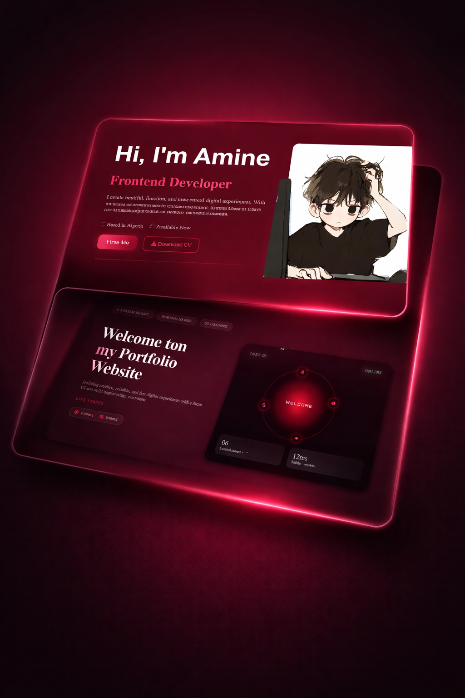

# Amine Portfolio Showcase 💻

Welcome to Amine's Portfolio Showcase!
A modern and elegant personal portfolio website built to present my projects, skills, and professional journey using HTML, CSS, and JavaScript.
---

## Live Demo 🚀

You can view the live website here: [Live Demo](https://cozy-crisp-b269de.netlify.app/)

---

## 🌟 Website Sections

- **Home**: Developer introduction with avatar and short description  
- **About**: Experience, tech stack, personal insights, and skill cards  
- **Projects**: Showcase of projects with images, descriptions, and skills  
- **Services**: Highlighting services offered with interactive cards  
- **Contact**: Contact form and social links with interactive hover effects  

---

## ⚡ Features

- Clean & modern UI design
- Smooth animations and transitions
- Fully responsive (Desktop / Tablet / Mobile)
- Interactive sections & hover effects
- Clean and organized code structure
- Fast performance & lightweight 

---

## 🛠 Technologies Used

- **HTML5** – Structure and semantic content  
- **CSS3** – Styling, responsive layouts, Flexbox & Grid  
- **JavaScript (Vanilla JS)** – Interactivity and animations  
- **Font Awesome / Boxicons** – Icons  
- **AOS.js** – Scroll animations  

---

## License

This project is licensed under the terms described in the [LICENSE](LICENSE) file.

---

## 🚀 How to Use / Customize

1. **Clone the repository:**

 ---

## 📬 Contact

- Email: aminehamzaoui1925@gmail.com   
- Location: Boumerdès, Algeria  
- LinkedIn: [LinkedIn](https://www.linkedin.com/in/mohamed-amine-hamzaoui-a2453a35b/)  
- GitHub: [GitHub](https://github.com/Saboo24)  
- Instagram: [Instagram](https://www.instagram.com/a__m.i.n__e/?utm_source=ig_web_button_share_sheet)

---

Made with ❤️ by **Amine Hamzaoui**


```bash
git clone https://github.com/Saboo24/portofolio8.git
